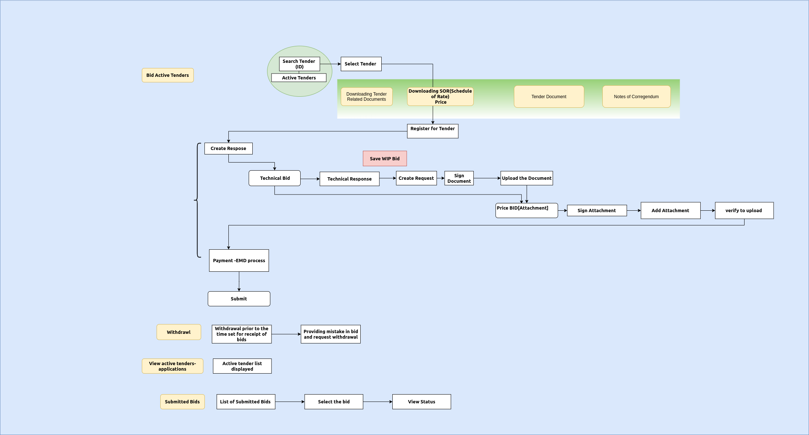
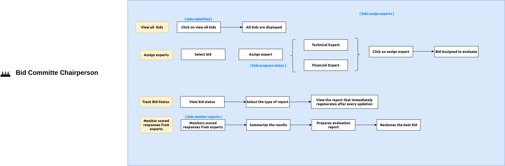
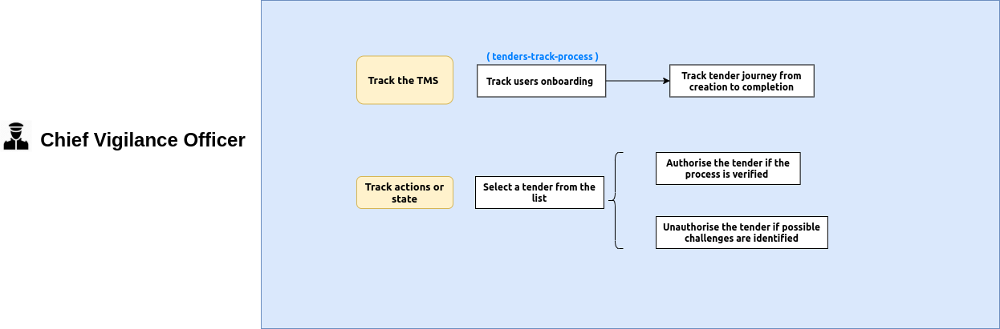

Status of Tender Bullet
========================

Architecture Diagram
++++++++++++++++++++++

    .. image:: images/ArchitectureDiagram.png

Use Cases
+++++++++

Tender Creator
--------------

.. image:: images/TenderCreator.png

Tender Manager
--------------

.. image:: images/tenderManager.png

Bidder
------

Bid Evaluation Committe
------------------------

.. image:: images/BidEvalCommitte.png

Bid Evaluation Chairperson
---------------------------

CVO
----

Old UseCases
------------

.. image:: images/OldUseCases.png

Kafka Topics
++++++++++++

    +-----+--------------------------+--------------------------------+--------------------------------+----------+
    | SNO |       Stakeholders       | Producer in Springboot(Events) | Kafka Topic Stream of Records  | Consumer |
    +=====+==========================+================================+================================+==========+
    | 1   |      Tender Creator      |                                |        tender-create-new       |          |
    |     |                          +--------------------------------+--------------------------------+----------+
    |     |                          |                                |          tender-active         |          |
    |     |                          +--------------------------------+--------------------------------+----------+
    |     |                          |                                |          tender-closed         |          |
    |     |                          +--------------------------------+--------------------------------+----------+
    |     |                          |                                |      tender-info-documents     |          |
    |     |                          +--------------------------------+--------------------------------+----------+
    |     |                          |                                |    tender-sent-for-approval    |          |
    |     |                          +--------------------------------+--------------------------------+----------+
    |     |                          |                                |          tender-draft          |          |
    |     |                          +--------------------------------+--------------------------------+----------+
    |     |                          |                                |         tender-repulish        |          |
    |     |                          +--------------------------------+--------------------------------+----------+
    |     |                          |                                |     tender-template-create     |          |
    |     |                          +--------------------------------+--------------------------------+----------+
    |     |                          |                                |     tender-template-delete     |          |
    +-----+--------------------------+--------------------------------+--------------------------------+----------+
    |                                                                                                             |
    +-----+--------------------------+--------------------------------+--------------------------------+----------+
    | 2   | Tender Manager           |                                |         tender-approve         |          |
    |     |                          +--------------------------------+--------------------------------+----------+
    |     |                          |                                |          tender-reject         |          |
    |     |                          +--------------------------------+--------------------------------+----------+
    |     |                          |                                |      tender-pending-review     |          |
    |     |                          +--------------------------------+--------------------------------+----------+
    |     |                          |                                |     tender-mark-corrigendum    |          |
    |     |                          +--------------------------------+--------------------------------+----------+
    |     |                          |                                |                                |          |
    +-----+--------------------------+--------------------------------+--------------------------------+----------+
    |                                                                                                             |
    +-----+--------------------------+--------------------------------+--------------------------------+----------+
    | 3   | Bidder                   |                                |     bidder-profile-details     |          |
    |     |                          +--------------------------------+--------------------------------+----------+
    |     |                          |                                |      bid-documents-submit      |          |
    |     |                          +--------------------------------+--------------------------------+----------+
    |     |                          |                                |    bid-earnest-money-deposit   |          |
    |     |                          +--------------------------------+--------------------------------+----------+
    |     |                          |                                |           bid-approve          |          |
    |     |                          +--------------------------------+--------------------------------+----------+
    |     |                          |                                |           bid-reject           |          |
    |     |                          +--------------------------------+--------------------------------+----------+
    |     |                          |                                |       bid-progress-status      |          |
    |     |                          +--------------------------------+--------------------------------+----------+
    |     |                          |                                |      bidder-notifications      |          |
    +-----+--------------------------+--------------------------------+--------------------------------+----------+
    |                                                                                                             |
    +-----+--------------------------+--------------------------------+--------------------------------+----------+
    | 4   | Bid Evaluation Committee |                                |     bid-approved-documents     |          |
    |     |                          +--------------------------------+--------------------------------+----------+
    |     |                          |                                |      bid-fee-confirmation      |          |
    |     |                          +--------------------------------+--------------------------------+----------+
    |     |                          |                                |          bid-accepted          |          |
    |     |                          +--------------------------------+--------------------------------+----------+
    |     |                          |                                |          bid-rejected          |          |
    |     |                          +--------------------------------+--------------------------------+----------+
    |     |                          |                                |       bid-pending-review       |          |
    +-----+--------------------------+--------------------------------+--------------------------------+----------+
    |                                                                                                             |
    +-----+--------------------------+--------------------------------+--------------------------------+----------+
    | 5   | Chief Vigilance Officer  |                                |     tender-mark-suspicious     |          |
    |     |                          +--------------------------------+--------------------------------+----------+
    |     |                          |                                |        tender-mark-fraud       |          |
    |     |                          +--------------------------------+--------------------------------+----------+
    |     |                          |                                |      tender-mark-verified      |          |
    +-----+--------------------------+--------------------------------+--------------------------------+----------+

Status of View Screens
++++++++++++++++++++++

+-------------------------+-------------------------------------+--------+---------+--+--+
| StakeHolders            | User Stories                        | Status | Reviews |  |  |
+-------------------------+-------------------------------------+--------+---------+--+--+
| Tender Creator          | Tender Creation                     | Done   |         |  |  |
|                         +-------------------------------------+--------+---------+--+--+
|                         | Publishing of Corrigendum           | Done   |         |  |  |
|                         +-------------------------------------+--------+---------+--+--+
|                         | Tender Status                       | Done   |         |  |  |
|                         +-------------------------------------+--------+---------+--+--+
|                         | View Acive Tenders                  | Done   |         |  |  |
+-------------------------+-------------------------------------+--------+---------+--+--+
| Bidder                  | View Open Tenders                   |        |         |  |  |
|                         +-------------------------------------+--------+---------+--+--+
|                         | Downloading Tender Related Document |        |         |  |  |
|                         +-------------------------------------+--------+---------+--+--+
|                         | Subscribe Bid                       |        |         |  |  |
|                         +-------------------------------------+--------+---------+--+--+
|                         | Withdrawl                           |        |         |  |  |
|                         +-------------------------------------+--------+---------+--+--+
|                         | BID Templates                       |        |         |  |  |
+-------------------------+-------------------------------------+--------+---------+--+--+
| Tender Manager          |                                     |        |         |  |  |
+-------------------------+-------------------------------------+--------+---------+--+--+
| Bid Evaluation Committe |                                     |        |         |  |  |
+-------------------------+-------------------------------------+--------+---------+--+--+
| Chief Vigilance Officer |                                     |        |         |  |  |
+-------------------------+-------------------------------------+--------+---------+--+--+

Transactions
++++++++++++

   .. image:: images/transactions.png

